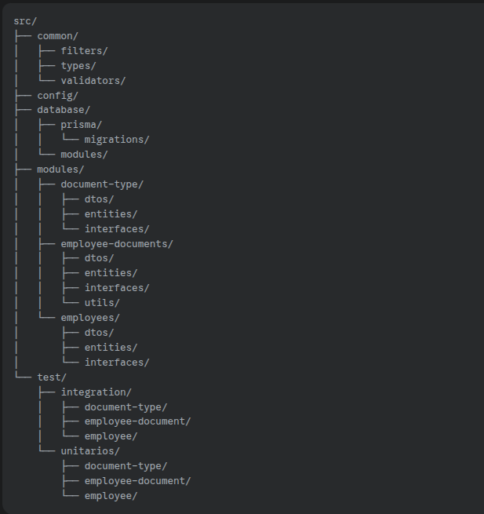

# API de Gerenciamento de Documentação de Colaboradores

## 📝 Descrição do Projeto

Esta API RESTful foi desenvolvida com o objetivo de gerenciar o fluxo de documentação obrigatória de colaboradores. Ela permite o cadastro e a atualização de informações de colaboradores e tipos de documentos, bem como a vinculação/desvinculação desses documentos a cada colaborador. O sistema acompanha o status de envio dos documentos, indicando o que está pendente e o que já foi entregue, facilitando a gestão e conformidade da documentação.

---

## 🚀 Tecnologias Utilizadas

A aplicação foi construída utilizando um stack moderno e robusto, focado em performance, escalabilidade e manutenibilidade:

* **Linguagem:** [TypeScript](https://www.typescriptlang.org/)
* **Framework:** [NestJS](https://nestjs.com/) (Framework Node.js progressivo para construir aplicações server-side eficientes e escaláveis)
* **ORM:** [Prisma ORM](https://www.prisma.io/) (Next-generation ORM para Node.js e TypeScript, com tipagem forte e migrações declarativas)
* **Banco de Dados:** [PostgreSQL](https://www.postgresql.org/) (Utilizado em ambiente de desenvolvimento local via Docker Compose)
* **Validação:** [Class-validator](https://github.com/typestack/class-validator) & [Class-transformer](https://github.com/typestack/class-transformer)
* **Documentação da API:** [Swagger (OpenAPI)](https://swagger.io/)
* **Testes:** [Jest](https://jestjs.io/) (Framework de testes unitários e de integração) & [Supertest](https://github.com/visionmedia/supertest) (para testes HTTP de integração de Controller/Service)
* **Containerização:** [Docker](https://www.docker.com/) & [Docker Compose](https://docs.docker.com/compose/) (Para ambiente de desenvolvimento local isolado e preparação para deploy)
* **Controle de Acesso:** [Throttler](https://github.com/nestjs/throttler) (Rate Limiting para proteção da API)

---

## ✨ Funcionalidades

A API oferece as seguintes funcionalidades essenciais para o gerenciamento de documentação de colaboradores:

* **Cadastro de Colaborador:** Registro de novos colaboradores com informações básicas (nome, CPF, data de contratação).
* **Atualização de Colaborador:** Modificação das informações de colaboradores existentes.
* **Cadastro de Tipo de Documento:** Definição de diferentes categorias de documentos (ex: CPF, RG, Carteira de Trabalho).
* **Vinculação e Desvinculação de Documentos:**
    * Associação de um ou mais tipos de documentos a um colaborador específico.
    * Remoção de associações de documentos de um colaborador.
    * Validação para impedir a vinculação de documentos já atribuídos.
* **Envio de Documentos:**
    * Registro do envio de um documento específico por um colaborador.
    * A "representação" do documento é suficiente, sem a necessidade de upload de arquivos ou metadados de arquivo (conforme especificação). O status interno do documento é atualizado.
* **Status da Documentação por Colaborador:** Consulta detalhada de todos os documentos vinculados a um colaborador, indicando quais foram enviados e quais ainda estão pendentes.
* **Listagem de Documentos Pendentes:**
    * Listagem paginada de todos os documentos que estão pendentes de envio.
    * Resultados agrupados por colaborador para melhor visualização.
    * Filtros opcionais por colaborador e por tipo de documento.
* **Rate Limiting:** Controle de taxa de requisições para proteger a API contra uso excessivo ou malicioso.

---

## 🏗️ Arquitetura do Projeto

O projeto segue uma arquitetura baseada em módulos e camadas, inspirada nos princípios da Arquitetura Limpa, promovendo a separação de responsabilidades e a manutenibilidade.



---

## 📊 Relatório Técnico: Escolhas e Padrões de Design

Este projeto foi desenvolvido com atenção a princípios de design de software e boas práticas, visando criar uma aplicação eficiente, robusta e fácil de manter.

### Princípios SOLID

A arquitetura do projeto foi guiada pelos princípios SOLID para promover um código mais robusto, flexível e fácil de manter:

* **Single Responsibility Principle (SRP):** Cada classe ou módulo possui uma única responsabilidade bem definida. Por exemplo, os Controllers lidam com requisições HTTP, os Services com a lógica de negócio, e os Repositories com o acesso a dados.
* **Open/Closed Principle (OCP):** Entidades de software (classes, módulos, funções, etc.) devem ser abertas para extensão, mas fechadas para modificação. Isso é facilitado pela injeção de dependência do NestJS e pelo uso de interfaces.
* **Dependency Inversion Principle (DIP):** Módulos de alto nível não dependem de módulos de baixo nível, mas sim de abstrações. Isso é evidente no uso de interfaces de repositório (`IEmployeeRepository`, `IDocumentTypeRepository`, `IEmployeeDocumentRepository`), permitindo que os serviços dependam dessas interfaces, e não de implementações concretas (como o `PrismaService`).

### Padrão Repository

O **Padrão Repository** foi implementado para abstrair a camada de acesso a dados. Os serviços interagem com o banco de dados através de interfaces de repositório, que são então implementadas por classes específicas (ex: `EmployeeRepository` usando Prisma).
* **Benefício:** Isso desacopla a lógica de negócio do serviço da tecnologia de banco de dados e do ORM, facilitando a troca do ORM ou do banco de dados no futuro, e simplificando os testes unitários dos serviços.

### Gerenciamento de Ambientes e Configuração

* **Variáveis de Ambiente (`.env`):** Todas as configurações sensíveis e específicas de ambiente (URLs de banco de dados, portas, etc.) são gerenciadas via variáveis de ambiente, carregadas pelo `@nestjs/config`.
* **Configuração Dinâmica:** O `src/config/database.config.ts` é responsável por definir a URL do banco de dados baseada no `NODE_ENV`. O `schema.prisma` utiliza `env("DATABASE_URL")` e possui o `provider = "postgresql"` fixo, adequado para o ambiente de desenvolvimento local com PostgreSQL via Docker.

### Tratamento de Erros

Um **Filtro de Exceção Global (`AllExceptionsFilter`)** foi implementado para padronizar as respostas de erro da API.
* **Benefício:** Garante que todas as exceções (sejam elas `HttpException` do NestJS, erros específicos do Prisma como violações de chave estrangeira/unicidade, ou erros genéricos) sejam capturadas e retornem um formato JSON consistente, com `statusCode`, `message`, `error` e `path`, facilitando o consumo da API.
* **Observação:** Por se tratar de um desafio técnico feito em tempo livre, não foi implementado um sistema de exceções personalizadas de negócio, utilizando-se as exceções padrão do NestJS com mensagens claras. O foco foi na robustez do handler global.

### Testes Automatizados

Uma robusta estratégia de testes automatizados foi implementada para garantir a qualidade e a confiabilidade da aplicação:

* **Testes Unitários:** Focados na **lógica de negócio dos serviços**, testando-os isoladamente através do mocking dos repositórios. Isso garante a correção da lógica central e a rápida identificação de bugs.
* **Testes de Integração:** Realizados a nível de **Controller-Service**, onde o controlador e o serviço são testados em conjunto, enquanto as dependências de repositório são mockadas. Isso valida a comunicação entre essas camadas e a formatação das respostas da API, sem interagir com o banco de dados real. Todos os testes estão passando.

### Containerização com Docker

A aplicação foi containerizada usando Docker para garantir portabilidade e consistência entre ambientes de desenvolvimento.

* **`Dockerfile`:** Define o processo de construção da imagem Docker da aplicação, utilizando um `multi-stage build` para criar imagens leves e otimizadas para produção.
* **`docker-compose.yml`:** Orquestra o ambiente de desenvolvimento local, levantando a API, o banco de dados PostgreSQL e o Redis em contêineres, facilitando a configuração e o gerenciamento de dependências.

### Deploy

Uma vez que a aplicação já esta rodando em um container, a forma mais simples de colocá-la no ar seria usando algum serviço de Containers, como o Azure Container Apps usando o Azure Devops, que simplifica bem o processo e é bem intuitivo, sabendo porém que o container pode ser usado em qualquer outra Cloud. 

* **`Dockerfile`:** Define o processo de construção da imagem Docker da aplicação, utilizando um `multi-stage build` para criar imagens leves e otimizadas para produção.
* **`docker-compose.yml`:** Orquestra o ambiente de desenvolvimento local, levantando a API, o banco de dados PostgreSQL e o Redis em contêineres, facilitando a configuração e o gerenciamento de dependências.


---

## ⚙️ Instalação e Execução (Desenvolvimento Local)

Para configurar e rodar a API localmente utilizando Docker Compose:

### Pré-requisitos

* [Node.js](https://nodejs.org/en/) (v20.x ou superior)
* [npm](https://www.npmjs.com/) (ou Yarn)
* [Docker Desktop](https://www.docker.com/products/docker-desktop/) (ou Docker Engine/Podman)

### Passos

1.  **Clone o Repositório:**
    ```bash
    git clone [URL_DO_SEU_REPOSITORIO]
    cd doc-api-inmeta
    ```

2.  **Instale as Dependências do Projeto:**
    ```bash
    npm install
    ```

3.  **Configurações do Ambiente (`.env`):**
    Crie um arquivo `.env` na raiz do projeto (no mesmo nível de `package.json`) e configure as variáveis de ambiente necessárias para o desenvolvimento local com Docker Compose.

    ```env
    # .env
    NODE_ENV=development

    # Configuração do Banco de Dados PostgreSQL (serviço 'db' no Docker Compose)
    DATABASE_URL="postgresql://user:password@db:5432/doc_api_db_local"
    DATABASE_PROVIDER="postgresql"

    # Configurações do Redis (serviço 'redis_cache' no Docker Compose)
    REDIS_HOST=redis_cache
    REDIS_PORT=6379
    REDIS_PASSWORD="password" # Use a senha que você definiu no docker-compose.yml
    REDIS_TTL=3600000 # TTL padrão do cache em milissegundos (1 hora)

    # Configurações do Throttler (Rate Limit)
    THROTTLER_TTL=60000 # 60 segundos
    THROTTLER_LIMIT=10  # 10 requisições
    ```
    **Importante:** As credenciais (`user`, `password`, `doc_api_db_local`) para o `DATABASE_URL` no `.env` devem ser as mesmas definidas para o serviço `db` no `docker-compose.yml`. A senha do `REDIS_PASSWORD` também deve ser a mesma.

4.  **Levantar o Ambiente Docker Compose:**
    Este comando irá construir a imagem da sua API, e levantar os contêineres do PostgreSQL, Redis e da sua API.

    ```bash
    docker compose up --build -d
    ```

5.  **Aplicar Migrações no Banco de Dados Local:**
    Com o banco de dados PostgreSQL (`db`) rodando no Docker, aplique o esquema da sua API.

    ```bash
    docker compose exec api npx prisma migrate deploy
    ```
    * Este comando executa o `npx prisma migrate deploy` dentro do contêiner da sua API, que por sua vez se conecta ao contêiner `db` (PostgreSQL) e cria as tabelas definidas no seu `schema.prisma`.

6.  **Acessar a Aplicação:**
    Sua API estará agora acessível em:
    `http://localhost:3000`

---

## 📚 Endpoints da API (Swagger)

A documentação interativa da API está disponível via Swagger UI.

Após iniciar a aplicação (passo 6 da instalação), acesse a seguinte URL no seu navegador:

`http://localhost:3000/api-docs`

Você poderá explorar todos os endpoints disponíveis, seus modelos de dados, e realizar requisições de teste diretamente da interface do Swagger.

---

## ✅ Executando Testes Automatizados

Para rodar os testes unitários e de integração:

1.  **Certifique-se de que o ambiente Docker Compose NÃO está rodando.** Se estiver, derrube-o com `docker compose down`.
2.  **Execute os Testes:**
    ```bash
    npm test
    ```
    * Este comando executará todos os testes unitários (focados na lógica de negócio dos serviços) e os testes de integração (focados na comunicação entre controladores e serviços, mockando repositórios).

---

## ⏭️ Próximos Passos (Melhorias Futuras)

* **Melhoria no Tratamento de Exceções:** Implementar exceções personalizadas de negócio para tornar o código mais expressivo e facilitar o tratamento de erros específicos de domínio.
* **Estratégia de Cache:** Adicionar uma estratégia de cache em endpoints de leitura frequente para otimizar o desempenho e reduzir a carga no banco de dados.
* **Segurança Abrangente:** Melhorar a segurança da API com autenticação (ex: JWT) e autorização baseada em papéis.
* **Deploy em Nuvem:** Configurar pipelines de CI/CD para deploy automatizado em plataformas de nuvem (ex: Google Cloud Run, AWS ECS).
* **Logging Estruturado:** Utilizar uma solução de logging mais robusta (ex: Pino, Winston) e enviar logs para um sistema centralizado.

---
